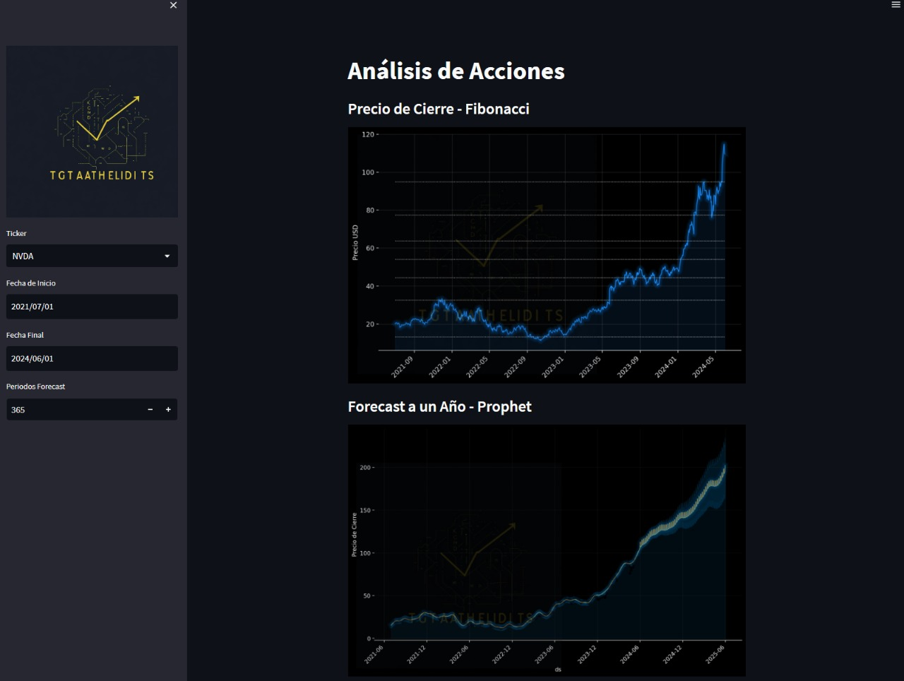
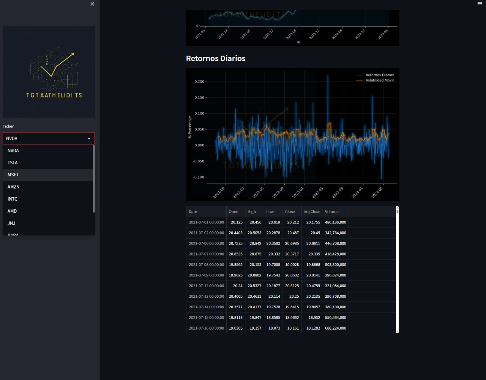

# Bolsa Tool

## Descripción

**Bolsa Tool** es una aplicación web desarrollada en Streamlit que te permite hacer el seguimiento de tu cartera de inversión de manera fácil e intuitiva. Con esta herramienta, puedes monitorear el rendimiento de tus inversiones, visualizar estadísticas clave y obtener información actualizada sobre el mercado financiero.

## Características

- **Seguimiento de la cartera**: Añade y gestiona diferentes activos en tu cartera de inversión.
- **Visualización de datos**: Gráficos interactivos y tablas para visualizar el rendimiento y las estadísticas de tus inversiones.
- **Actualización en tiempo real**: Información actualizada del mercado para ayudarte a tomar decisiones informadas.
- **Interfaz intuitiva**: Diseñada para ser fácil de usar, incluso para aquellos con poca experiencia en inversiones.

## Capturas de Pantalla






## Instalación

Para ejecutar la aplicación en tu máquina local, sigue estos pasos:

1. **Clona el repositorio**:
   ```bash
   git clone https://github.com/tuusuario/bolsa_tool.git
   cd bolsa_tool
   ```

2. **Crea un entorno virtual** (opcional pero recomendado):
   ```bash
   python -m venv env
   source env/bin/activate    # En Windows usa `env\Scripts\activate`
   ```

3. **Instala las dependencias**:
   ```bash
   pip install -r requirements.txt
   ```

4. **Ejecuta la aplicación**:
   ```bash
   streamlit run bolsa_tool.py
   ```

## Uso

1. **Iniciar la aplicación**:
   - Después de ejecutar `streamlit run bolsa_tool.py`, abre tu navegador y navega a `http://localhost:8501`.

2. **Añadir activos a tu cartera**:
   - Usa el formulario de entrada para agregar los activos que deseas rastrear.
   
3. **Visualizar estadísticas**:
   - Explora las diferentes pestañas para ver gráficos interactivos, tablas y más información sobre tu cartera.

## Contribución

Si deseas contribuir a este proyecto, sigue estos pasos:

1. **Fork el repositorio**.
2. **Crea una rama para tu característica o corrección** (`git checkout -b feature/nueva-caracteristica`).
3. **Haz commit de tus cambios** (`git commit -m 'Añadir nueva característica'`).
4. **Haz push a la rama** (`git push origin feature/nueva-caracteristica`).
5. **Abre un Pull Request**.

## Licencia

Este proyecto está licenciado bajo la Licencia MIT - consulta el archivo [LICENSE](LICENSE) para más detalles.

## Contacto

Para cualquier consulta o sugerencia, por favor contacta a [tu correo] o crea una issue en el repositorio.
